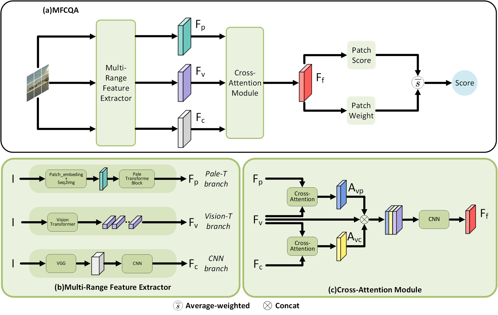

# MFCQA: Multi-Range Feature Cross-Attention Mechanism for No-Reference Image Quality Assessment
This is the official repository of the paper "MFCQA: Multi-Range Feature Cross-Attention Mechanism for No-Reference Image Quality Assessment".

# Overall Architecture
The model we propose consists of three main components: Multi-Range Feature Extraction Module (MFE), Cross-Attention Module (CAM), and Dual-Branch Score Prediction Module. MFE is responsible for extracting global, sub-global, and local features. These features capture different information at various ranges, enabling the model to understand both the overall context and subtle details simultaneously.The CAM aims to integrate the global, sub-global, and local features extracted by MFE. It selectively combines and emphasizes relevant features from each range using attention mechanisms, allowing the model to focus on important information while suppressing noise or irrelevant details.The Dual-Branch Score Prediction Module performs weighted computations on different patches. It utilizes the features fused by CAM and applies specific weights to different patches, enabling the model to assign varying importance to different regions. This allows the model to make accurate predictions by considering the unique characteristics of each patch. 

  

# TODO
- [ ] Initialization
- [ ] Code release
- [ ] Checkpoints
